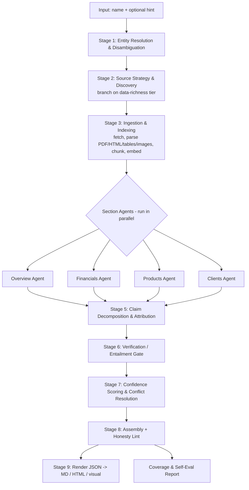

# Company One-Pager Agent — Architecture & Design

> **Status:** Proposal for review. Nothing is executed yet.
> **Goal:** Produce a fully-sourced, confidence-tagged company one-pager from minimal input (company name + optional hint), matching the *content* of the GPIL sample, and run it on **Bharat Forge Limited** (data-rich) and **Brakes India Private Limited** (data-sparse).

---

## 0. The one idea this whole system is built around

The brief says, in plain words, what they are *really* testing:

> "We want a system that knows the difference between *'I found this in [source]'* and *'I could not verify this'* … One that surfaces confidence, cites what it used, and leaves something out rather than inventing it."

So the architecture is not "an LLM that writes a one-pager." It is a **retrieval-and-verification pipeline where the LLM is never allowed to be the source of a fact.** Every fact in the final document must trace to a retrieved span of text or data from a real, re-openable source. If it can't, it doesn't appear — it either becomes an explicit *"not found in available sources"* or it is silently dropped.

This single principle drives every design decision below. I'll call it the **Grounding Contract**:

> **No claim is emitted unless (a) it is backed by at least one retrieved source span, and (b) an independent verification step confirms that the span actually supports the claim.** Confidence is a function of *how well* it is supported, not *how sure the model sounds.*

---

## 1. Design principles (the "why" behind the choices)

| # | Principle | What it means in practice |
|---|-----------|---------------------------|
| 1 | **Retrieve-then-claim, never recall-then-claim** | The LLM's parametric memory is treated as untrustworthy. Generation is *closed-book over a retrieved evidence set* — the model may only state what's in the evidence we handed it. |
| 2 | **Claim is the atomic unit** | The document is not "paragraphs." It is a list of atomic claims, each with `text → evidence → confidence → status`. Rendering happens *last*, from this structured object. |
| 3 | **Verification is a separate stage from generation** | The model that *writes* a claim is not trusted to *grade* it. A distinct entailment/verification pass (different prompt, ideally cross-model) gates every claim. |
| 4 | **Honest gaps are first-class outputs** | `NOT_FOUND` is a valid, designed result with its own schema and rendering — not an error. A sparse company should produce a sparse-but-honest page, and *that contrast is the deliverable.* |
| 5 | **Derived ≠ reported** | Growth %, margins, etc. are *computed* from sourced base figures and labeled as derived, citing the underlying numbers. We never "source" a percentage we calculated ourselves as if a filing stated it. |
| 6 | **Source provenance is immutable and re-openable** | Every source is captured (URL, publisher, date, retrieval timestamp, exact quote, and where possible a stored snapshot) so a reviewer can re-open and check it. |
| 7 | **Entity resolution before anything** | "Brakes India" must be pinned to the exact legal entity (TVS group, its CIN) before we search, or we contaminate evidence with the wrong company. |
| 8 | **Tiered strategy by data-richness** | Listed vs unlisted changes *which sources exist*, so the pipeline branches early and sets honest expectations for what's achievable. |

---

## 2. What "done" looks like (output spec)

Canonical output is a single **JSON** object (the source of truth). Markdown / HTML / a GPIL-style visual are *renderers* over that JSON.

The four anchor regions from the sample:

1. **Company Overview** — bulleted, every line a cited claim.
2. **Financial Overview** — multi-year table (e.g. FY21–FY24): Revenue, Growth %, a margin, EBITDA / EBITDA %, a leverage/returns metric (Net Debt, RoCE), Net Working Capital days — each *cell* individually sourced.
3. **Select Products** — verified products, with image where a source supports it.
4. **Select Clients** — verified customers, with logo where the relationship is sourced (logo image and relationship evidence are tracked separately).

Plus a **Provenance Appendix**: every source listed once, with the claims it supports, and a **Coverage/Honesty report** (how many claims verified, how many gaps, confidence distribution).

---

## 3. Core data model (the heart of the system)

Everything flows through these schemas (Pydantic models, enforced end-to-end).

```python
Source = {
  "id": "S1",
  "url": "https://...",
  "title": "Bharat Forge Annual Report FY24",
  "publisher": "Bharat Forge Limited",
  "source_type": "annual_report | investor_presentation | company_website |
                  regulatory_filing | financial_api | news | logo_db | other",
  "publication_date": "2024-06-30",
  "retrieved_at": "2026-06-02T...Z",
  "access": "public | paywalled | login_required",
  "reliability_tier": 1,          # 1 = primary/regulatory, ... 5 = marketing/aggregator
  "snapshot_path": "store/S1.pdf" # local capture so the reviewer can re-open it
}

Evidence = {                       # a precise pointer INTO a source
  "source_id": "S1",
  "locator": {"page": 142, "table": "P&L", "cell": "Revenue/FY24",
              "char_span": [1203, 1290]},   # whatever applies
  "exact_quote": "Revenue from operations ... 15,254.7"   # verbatim
}

Claim = {
  "id": "C17",
  "section": "overview | financials | products | clients",
  "text": "Bharat Forge operates forging plants in Pune (Mundhwa) and Baramati.",
  "claim_type": "qualitative | quantitative | entity_relationship",
  "value": {...},                  # structured payload for quantitative claims
  "evidence": [Evidence, ...],     # >=1 required, or status=NOT_FOUND
  "corroboration_count": 2,        # # of *independent* sources agreeing
  "verification": {"entailment": "entailed | partial | contradicted | none",
                   "judge_model": "...", "rationale": "..."},
  "confidence": {"score": 0.0-1.0, "label": "High|Medium|Low", "rationale": "..."},
  "status": "VERIFIED | UNVERIFIED | NOT_FOUND | CONFLICTED"
}

FinancialCell = {                  # a specialized quantitative claim
  "metric": "revenue", "period": "FY24", "value": 15254.7,
  "unit": "INR_crore", "basis": "reported | derived",
  "derived_from": ["C..","C.."],   # if computed (e.g. growth %)
  "evidence": [...], "confidence": {...}, "status": "..."
}

OnePager = {
  "entity": {resolved identity + CIN/ticker + disambiguation notes},
  "data_richness_tier": "rich | moderate | sparse",
  "sections": {overview:[Claim], financials:[FinancialCell], products:[...], clients:[...]},
  "sources": [Source, ...],
  "coverage_report": {verified, not_found, conflicted, confidence_histogram},
  "run_metadata": {models, tools, cost, latency, timestamps}
}
```

Why this shape: it makes the Grounding Contract *mechanically checkable*. A final lint step can simply assert: **every `Claim` with `status=VERIFIED` has ≥1 `Evidence` and `verification.entailment ∈ {entailed, partial}`** — otherwise the build fails. Honesty becomes an invariant, not a hope.

---

## 4. Pipeline overview



Orchestrated as a **stateful graph** (LangGraph). The shared state is the evidence store + the growing list of `Claim`s. Section agents run concurrently; verification and scoring are global passes.

---

## 5. Stage-by-stage detail

### Stage 1 — Entity Resolution & Disambiguation
- Resolve the input to a **canonical legal entity**: official name, country, listing status, ticker (BHARATFORG / NSE+BSE for Bharat Forge), and registry ID (**CIN** for Indian companies; Brakes India is unlisted, so MCA/CIN is the anchor).
- Output a short disambiguation note (e.g. "Bharat Forge Limited, the Kalyani-group forging company — *not* its subsidiaries or BF Industries").
- **Why first:** wrong-entity contamination is the most dangerous silent error. Pinning identity early keeps later retrieval clean.

### Stage 2 — Source Strategy & Discovery (branches on data-richness)
A planner picks a retrieval plan based on tier:

| Tier | Example | Primary sources targeted |
|------|---------|--------------------------|
| **Rich (listed)** | Bharat Forge | Annual reports & investor presentations (IR site), stock-exchange filings, financial-data API, reputable financial press, company product pages |
| **Sparse (unlisted)** | Brakes India | Company website, MCA/registry filings (often paywalled), business registries (Tofler/Zauba-style), credit-rating reports, trade press, parent-group (TVS) disclosures |

Discovery tools: web search (LLM-optimized), neural/semantic search for hard-to-phrase queries, direct IR-site crawl, and the financial-data API. The planner explicitly records *what it looked for and didn't find* — that record feeds the honest `NOT_FOUND` outputs later.

### Stage 3 — Ingestion & Indexing
- **Fetch & snapshot** each candidate source (store a local copy for re-openability).
- **Parse by type:**
  - HTML → clean main-content extraction.
  - **PDF annual reports → layout-aware table extraction** (this is the make-or-break for financials; financial tables are notoriously hard).
  - Images → keep with source/page metadata; OCR captions where needed.
- **Chunk + embed** (local sentence-transformer embeddings) into a per-company vector store, with full metadata so every chunk knows its `Source` and `locator`. Retrieval returns chunks *with* their provenance attached — provenance is never reconstructed after the fact.

### Stage 4 — Section Agents (parallel, closed-book over evidence)
One specialized agent per region. Each:
1. Issues targeted retrieval queries against the evidence store.
2. Generates claims **only from returned evidence**, with a hard instruction: *if the evidence doesn't say it, don't write it; prefer `NOT_FOUND`.*
3. Emits draft `Claim`s, each already carrying candidate `Evidence` pointers.

- **Financials Agent** specifics: extract reported figures into `FinancialCell`s, normalize period (Indian FY ends March), currency/units (INR crore), then **compute** derived metrics (growth %, margins) — labeled `basis=derived` and linked to the base cells. Prefer a *single consistent source per metric series* to avoid mixing methodologies; cross-check against a second source and raise `CONFLICTED` on disagreement beyond tolerance.
- **Clients/Products Agents**: the *claim* ("X is a customer", "Y is a product") must be text-sourced. A logo or product image is attached separately and only as decoration — **we never infer a client relationship from a logo alone.**

### Stage 5 — Claim Decomposition & Attribution
Break any compound drafted sentence into **atomic** claims (one verifiable assertion each) and bind each to its exact supporting quote(s). Atomicity is what makes per-line citation and verification meaningful.

### Stage 6 — Verification / Entailment Gate (the honesty firewall)
For every claim, an independent checker asks: **"Does this exact quote actually entail this claim?"**
- Implemented as a strict LLM-as-judge using **Grok (xAI)** — a *different vendor* than the Claude writer — with a verification-only prompt.
- Output: `entailed | partial | contradicted | none`.
- **Gate rule:** `none`/`contradicted` → claim is dropped or flipped to `NOT_FOUND`. Only `entailed`/`partial` survive. This is where invented content dies.

### Stage 7 — Confidence Scoring & Conflict Resolution
Confidence is computed, not vibed:

```
confidence = w1*source_tier_score      # primary filing > API > news > marketing > aggregator
           + w2*corroboration          # # of independent agreeing sources
           + w3*recency                # newer filings preferred
           + w4*entailment_strength     # entailed > partial
           + w5*extraction_reliability  # clean table cell > OCR'd > loosely phrased prose
```
Mapped to **High / Medium / Low**. Conflicting sources → `CONFLICTED` status with both values and an explanation, rather than silently picking one.

### Stage 8 — Assembly + Honesty Lint
Compose the `OnePager`. Then run the **Honesty Lint** (build-breaking assertions):
- Every VERIFIED claim has ≥1 evidence + acceptable entailment.
- No financial cell is `derived` without its `derived_from` base cells present and sourced.
- Every client/product with an image still has an independent *relationship/existence* text source.
- Gaps are rendered as explicit "not found in available sources," never blank-filled.

### Stage 9 — Rendering
JSON → Markdown and HTML renderers (baseline scope; no visual PNG). Citations shown inline (superscript/footnote style) with a confidence chip per claim, and a full source list.

---

## 6. How the two test companies exercise the design

| | **Bharat Forge (rich)** | **Brakes India (sparse)** |
|---|---|---|
| Identity | Ticker BHARATFORG, NSE/BSE | Unlisted, CIN via MCA, TVS group |
| Financials | Reported figures from annual reports + cross-checked via API → mostly **High** confidence, multi-year table likely complete | Public clean figures scarce; many cells expected to be **`NOT_FOUND`** or low-confidence from paywalled MCA — *we say so* |
| Products/Clients | Named OEM customers & product range verifiable | Include only the few verifiable; leave the rest out cleanly |
| Expected shape | Dense, fully-sourced page | Sparse-but-honest page |

**The delta between these two outputs is the actual deliverable.** The sparse one passing the Honesty Lint with lots of clean `NOT_FOUND`s is a *success*, not a failure.

---

## 7. Tech stack & service choices — **FINALIZED**

This is the confirmed stack (keys provisioned / approach approved by reviewer).

| Concern | **Chosen** | Why | Status |
|---|---|---|---|
| Language / runtime | **Python 3.11** | Best ecosystem for parsing/ML | — |
| Orchestration | **LangGraph** + **Pydantic** structured outputs | Stateful multi-agent graph; schema enforcement makes the Grounding Contract checkable | — |
| Primary LLM (write + orchestrate) | **Claude (Anthropic, Sonnet-class)** | Strong instruction-following & citation discipline | key ✅ |
| **Verifier LLM (independent judge)** | **Grok (xAI)** | *Different vendor* from the writer → genuine cross-model checking, no shared blind spots | key ✅ |
| Web search / discovery | **Tavily** | LLM-optimized, returns content + URLs | key ✅ |
| Scraping / clean extraction | **Firecrawl** | JS-rendered pages → clean markdown, handles IR sites & crawls | key ✅ |
| PDF / financial-table parsing | **LlamaParse** | Layout-aware table extraction from annual reports — critical for the financial table | key ✅ |
| **Embeddings** | **Local sentence-transformers** (`bge`/`e5`-class) | No OpenAI key needed; runs locally, zero added cost/keys | local |
| Vector store | **LanceDB / Chroma** (local) | Zero-infra, per-company store | local |
| Financial data | **none — annual-report-PDF-first** | Most defensible & honest for Indian/unlisted names (see note) | approved |
| Logos / visual | **omitted** | Baseline outputs only; Clients cited in text, no logo images | approved |
| Outputs | **JSON (canonical) + Markdown + HTML** | Baseline per reviewer choice | approved |

**Financials = PDF-first (confirmed):** the company's own annual reports / filings are the primary, most-defensible source for the financial table. Western financial APIs have uneven coverage of NSE-listed and especially *unlisted* Indian names, so no financial API is used; corroboration comes from a second filing/press source where available.

**Two-model verification (confirmed):** Claude writes claims; **Grok independently grades entailment.** Because they're different vendors, a fact one model hallucinates is unlikely to be silently rubber-stamped by the other.

**Embeddings note:** since no OpenAI key is provisioned, retrieval uses a local embedding model (e.g. `BAAI/bge-*` or `intfloat/e5-*` via `sentence-transformers`). This keeps the only external LLM calls on Claude (write) and Grok (verify).

---

## 8. Repository structure (proposed)

```
onepager-agent/
  README.md                  # setup + architecture overview + how-to-run
  ARCHITECTURE.md            # this document
  pyproject.toml
  .env.example               # all required keys, documented
  src/onepager/
    schemas.py               # Pydantic: Source, Evidence, Claim, FinancialCell, OnePager
    graph.py                 # LangGraph orchestration
    stages/
      entity_resolution.py
      discovery.py
      ingestion.py           # fetch, parse (pdf/html/img), chunk, embed
      agents/{overview,financials,products,clients}.py
      decompose.py
      verify.py              # entailment gate
      confidence.py
      assemble.py            # + honesty lint
    render/{markdown.py, html.py, visual.py}
    tools/{search.py, scrape.py, pdf.py, finance_api.py, logos.py}
    store/                   # cached source snapshots + vector db (gitignored, except sample)
  outputs/
    bharat_forge/{onepager.json, onepager.md, onepager.html, coverage.md}
    brakes_india/{onepager.json, onepager.md, onepager.html, coverage.md}
  evals/                     # self-eval harness + results
  WRITEUP.md                 # ~1 page: what broke, trade-offs, what's next
```

---

## 9. Self-evaluation harness (for the write-up, 15%)

Automated, runs on both companies:
- **Citation coverage:** % of claims with valid evidence (target: 100% by construction).
- **Verification pass rate:** % surviving the entailment gate.
- **Re-openability spot check:** sample N citations, confirm the quote exists at the stored locator.
- **Confidence distribution** per company (expect rich » sparse).
- **Gap report:** what came back `NOT_FOUND`/`CONFLICTED` and why.
- **Cost & latency** per run.

These numbers feed `WRITEUP.md` (trade-offs: cost vs. depth, latency vs. corroboration, recall vs. honesty) so the self-assessment is evidence-based, not hand-wavy.

---

## 10. Key risks & how the design handles them

| Risk | Mitigation |
|---|---|
| Model invents a plausible figure/client | Closed-book generation + independent entailment gate + honesty lint (build fails on unsourced VERIFIED claims) |
| Financial table parsed wrong from PDF | Layout-aware parser, unit/period normalization, cross-source reconciliation, `CONFLICTED` flagging |
| Wrong entity / namesake | Dedicated entity-resolution stage with CIN/ticker anchoring |
| Paywalled MCA data for Brakes India | Try registries; if unavailable, emit honest `NOT_FOUND` — *by design* |
| Logo implies a relationship that isn't real | Relationship claim must be text-sourced; logo is decoration only, tracked separately |
| Stale data | `publication_date` + `retrieved_at` recorded; recency in confidence score |

---

## 11. Decisions — **RESOLVED**

All blocking decisions are settled:

- **Keys provisioned:** Anthropic (Claude), xAI (Grok), Tavily, Firecrawl, LlamaParse. No OpenAI → **local embeddings**. No financial API, no Brandfetch.
- **Financials:** annual-report-**PDF-first**. ✅
- **Outputs:** JSON + Markdown + HTML (baseline; no visual PNG). ✅
- **Verification:** **two-model** — Claude writes, **Grok** judges entailment. ✅

**Awaiting only the go-ahead to execute.** On approval I'll scaffold the repo per §8, wire the LangGraph pipeline, and run it end-to-end on Bharat Forge and Brakes India.
